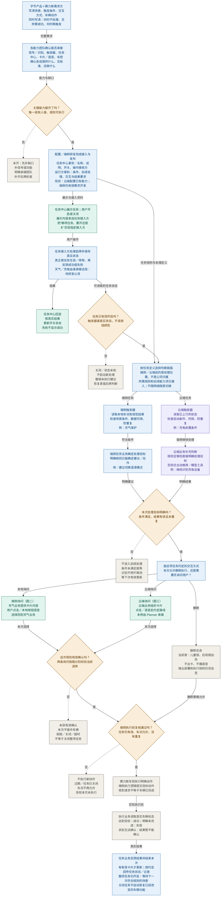
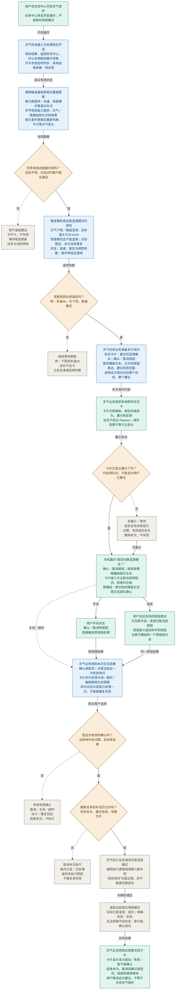
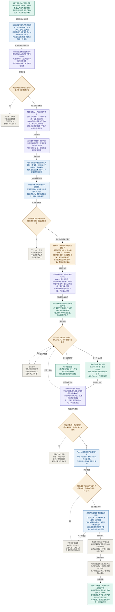

# 系统预设任务：三张业务流程图

> 业务评审方案，不代表已全部上线；每张图的待确认项请按图注会签。

## 01｜系统预设任务总业务流程

一项长期服务怎样从产品定义，走到用户真正得到结果。

```mermaid
flowchart TB
    P["字节产品＋赛力斯需求方<br/>写清场景、触发条件、交互方式、车辆动作<br/>同时写清：何时不处理、怎样算成功、何时再触发"]
    CAP["各能力团队确认能否承接<br/>信号／识别、触发器、任务中心、卡片／语音、车控<br/>确认各自提供什么、交给谁、还缺什么"]
    OK{"关键能力接齐了吗？<br/>每一段有人接、规则可执行"}
    GAP["未齐：先补缺口<br/>补信号或功能<br/>明确承接团队<br/>补齐后再检查"]
    PUB["配置／端侧研发完成接入与发布<br/>任务中心拿到：名称、说明、开关、操作接收方<br/>运行方拿到：条件、后续处理、交互与结果要求<br/>现状：云端配置已有能力；端侧仍有按需求开发"]
    TC["任务中心展示任务；用户开启或关闭<br/>展示内容来自任务接入方<br/>把“哪项任务、要开还是关”交给指定接入方"]
    BIZ["任务接入方处理启停并保存真实状态<br/>真正使任务生效／停用，再反馈成功或失败<br/>天气／充电由谁承接这段：待研发认领"]
    UI["任务中心回显<br/>按真实结果<br/>更新开关状态<br/>失败不显示成功"]
    ON{"任务已有效开启吗？<br/>触发器拿真实状态，不读按钮颜色"}
    OFF["关闭／状态未知<br/>不启动新处理<br/>撤销未执行建议<br/>恢复真值后再判断"]
    ROUTE["按任务定义选择判断链路<br/>端侧／云端说的是处理位置，不是公司归属<br/>所需规则和后续能力须已接入；不随网络随意切换"]
    EDGE["端侧触发器<br/>读取本地车况和视觉结果<br/>检查场景条件、数据可用、防重复<br/>例：天气保护"]
    CLOUD["云端触发器<br/>读取已上行的状态<br/>检查启动条件、时效、防重复<br/>例：充电前置条件"]
    ET["端侧任务业务确定处理目标<br/>明确规则已能确定建议／动作<br/>例：建议切换湿滑模式"]
    AI["云端业务补充判断<br/>规则足够则直接明确处理目标<br/>否则交主动推荐／模型工具<br/>例：继续识别充电设备"]
    TARGET{"本次处理目标明确吗？<br/>条件满足、结果有效且未重复"}
    WAIT["不进入后续处理<br/>条件未满足就等<br/>识别不明不猜测<br/>等下次有效更新"]
    MODE["查这项任务约定的交互方式<br/>本次允许静默执行，还是需要先询问用户？"]
    SILENT["静默任务<br/>当前表：儿童锁、后视镜加热<br/>不出卡、不播语音<br/>端云部署和执行规则仍须会签"]
    EASK["端侧询问（图二）<br/>天气业务提供卡片内容<br/>用户点击／本地按钮语音<br/>选择回到天气业务"]
    CASK["云端询问（图三）<br/>云端业务组织卡片<br/>点击／语音走约定路线<br/>本例由 Planner 承接"]
    CONSENT{"这次得到有效确认吗？<br/>两条询问链路分别校验当前选择"}
    CANCEL["未获有效确认<br/>本次不操作车辆<br/>拒绝／关闭／超时<br/>不等于关闭整项任务"]
    PRE{"端侧执行前复核通过吗？<br/>任务仍有效、车况允许、没有重复"}
    ABORT["不执行新动作<br/>过期／任务已关闭<br/>车况不再允许<br/>告知本次未执行"]
    CAR["赛力斯车控执行明确动作<br/>端侧执行逻辑提交目标动作<br/>收到请求不等于车辆已完成"]
    READ["执行业务读取真实车辆状态<br/>达到目标：成功；明确未完成：失败<br/>状态无法确认：结果暂不能确认"]
    RESULT["任务业务反馈结果并结束本次<br/>有有效卡片才更新；按约定回传任务状态／记录<br/>整项任务仍开启：等待下一次符合规则的场景<br/>关闭任务不自动恢复已经改变的车辆功能"]
    P -->|完整需求| CAP
    CAP -->|能力与缺口| OK
    OK -.->|否| GAP
    OK -->|是| PUB
    PUB -->|展示与接入资料| TC
    TC -->|用户操作| BIZ
    BIZ -->|结果| UI
    BIZ -->|可读取的任务状态| ON
    ON -.->|否| OFF
    PUB -->|任务规则与处理定义| ROUTE
    ON -->|是| ROUTE
    ROUTE -->|端侧任务| EDGE
    ROUTE -->|云端任务| CLOUD
    EDGE -->|符合条件| ET
    CLOUD -->|值得继续处理| AI
    ET -->|明确建议| TARGET
    AI -->|明确结果| TARGET
    TARGET -.->|否| WAIT
    TARGET -->|是| MODE
    MODE -->|静默| SILENT
    MODE -->|本地询问| EASK
    MODE -->|云端询问| CASK
    EASK -->|本次选择| CONSENT
    CASK -->|本次选择| CONSENT
    CONSENT -.->|否| CANCEL
    CONSENT -->|是| PRE
    SILENT -->|静默策略允许| PRE
    PRE -.->|否| ABORT
    PRE -->|是| CAR
    CAR -->|实际执行后| READ
    READ -->|真实结果| RESULT
    classDef business fill:#E6F1FB,stroke:#185FA5,color:#0C447C;
    classDef screen fill:#E1F5EE,stroke:#0F6E56,color:#085041;
    classDef decision fill:#FAEEDA,stroke:#854F0B,color:#633806;
    classDef cloud fill:#EEEDFE,stroke:#534AB7,color:#3C3489;
    classDef neutral fill:#F1EFE8,stroke:#5F5E5A,color:#444441;
    class P,CAP,PUB,BIZ,ROUTE,EDGE,ET,MODE,RESULT business;
    class TC,UI,EASK,CASK screen;
    class OK,ON,TARGET,CONSENT,PRE decision;
    class CLOUD,AI cloud;
    class GAP,OFF,WAIT,SILENT,CANCEL,ABORT,CAR,READ neutral;
```

## 02｜端侧天气保护业务流程

例：下雨时建议切湿滑模式；确认、执行、结果都在本地衔接。

```mermaid
flowchart TB
    TC["用户在任务中心开启天气保护<br/>任务中心转发开启操作；不直接切驾驶模式"]
    ENABLE["天气任务接入方处理真实开启<br/>保存结果，返回任务中心，并让本地触发器可读取<br/>开关状态如何同步、具体由谁承接：待会签"]
    DATA["端侧触发器收到相关数据更新<br/>赛力斯提供：车速、驾驶模式等真实车况<br/>字节视觉能力提供：天气／路面结构化识别结果<br/>相关条件更新后重新判断，不只等天气变化"]
    VALID{"任务有效且数据可用吗？<br/>状态不明、识别过时都不能当满足"}
    WAIT["暂不发起建议<br/>不开卡、不车控<br/>等待有效更新<br/>任务关闭则停用"]
    RULE["触发器检查这条湿滑建议的规则<br/>天气下雨／路面湿滑，且车速大于30 km/h<br/>驾驶模式还不是湿滑；识别稳定、本次没有重复<br/>并且／或者、稳定与频控参数：按评审结论落地"]
    HIT{"场景规则全部满足吗？<br/>例：车速46，仍下雨，普通模式"}
    NOTYET["继续等待更新<br/>例：下雨但车速20<br/>此时不出卡<br/>之后车速满足再判断"]
    ASKDEF["天气任务业务准备本次询问<br/>告诉卡片：建议切湿滑模式；确认／取消按钮<br/>提供播报文本、允许的按钮表达、建议有效范围<br/>说明这次询问对应哪个任务、哪个建议"]
    CARD["天气业务请求本地即时交互卡<br/>卡片负责接收、按优先级排队、展示和反馈<br/>此处不经过 Planner；请求受理不等于已显示"]
    SHOWN{"卡片已真正展示了吗？<br/>仍在排队时，不能当作用户已看见"}
    QUEUE["未展示：等待<br/>轮到且有效再显示<br/>过期、失败或任务关<br/>撤销本次，不车控"]
    VISIBLE["车机展示“是否切换湿滑模式？”<br/>确认／取消按钮；按语音策略播报提示文本<br/>卡片接入方注册当前按钮词，结束时注销<br/>禁播音／禁识别的降级方式需交互团队确认"]
    CLICK["用户手动点击<br/>确认／取消原按钮<br/>直接触发原按钮处理"]
    VAS["用户说出支持的按钮表达<br/>可见即可说：语音匹配当前按钮<br/>语音能力返回命中的按钮<br/>注册方模拟同一个原按钮点击"]
    CHOICE["天气业务收到本次交互结果<br/>确认或取消；关联当前这一次有效询问<br/>卡片另行反馈关闭／超时／被替换等生命周期<br/>同次点击与语音只处理一次，不直接重复车控"]
    YES{"是这次有效的确认吗？<br/>当前询问未过期，且尚未处理"}
    NO["未获有效确认<br/>取消／关闭／超时<br/>旧卡／重复回应<br/>结束本次，不执行"]
    PRE{"最新任务和车况仍允许吗？<br/>任务未关、建议有效、车辆允许"}
    ABORT["取消本次执行<br/>条件已变／已处理<br/>返回未执行原因<br/>不重复发车控"]
    EXEC["天气执行业务请求切换湿滑模式<br/>端侧执行逻辑调用赛力斯车控<br/>“收到请求”仅是过程，尚不能报切换成功"]
    READ["读取当前真实驾驶模式<br/>实际已是湿滑：成功；明确失败：失败<br/>无法获取可信状态：暂不能确认成功"]
    RESULT["天气业务把真实结果交回卡片<br/>卡片显示本次成功／失败／暂不能确认<br/>结束本次，取消旧确认按钮词，按规则继续等待<br/>用户取消这次建议，不等于关闭天气保护"]
    TC -->|开启操作| ENABLE
    ENABLE -->|真实有效状态| DATA
    DATA -->|当前数据| VALID
    VALID -.->|否| WAIT
    VALID -->|是| RULE
    RULE -->|逐项判断| HIT
    HIT -.->|否| NOTYET
    HIT -->|是| ASKDEF
    VISIBLE -.->|关闭／超时| CHOICE
    ASKDEF -->|本次询问内容| CARD
    CARD -->|展示状态| SHOWN
    SHOWN -.->|否| QUEUE
    SHOWN -->|是| VISIBLE
    QUEUE -->|可展示| VISIBLE
    VISIBLE -->|手动| CLICK
    VISIBLE -->|语音| VAS
    CLICK -->|原按钮结果| CHOICE
    VAS -->|同一按钮结果| CHOICE
    CHOICE -->|核对用户选择| YES
    YES -.->|否| NO
    YES -->|是| PRE
    PRE -.->|否| ABORT
    PRE -->|是| EXEC
    EXEC -->|车辆处理后| READ
    READ -->|实际结果| RESULT
    classDef business fill:#E6F1FB,stroke:#185FA5,color:#0C447C;
    classDef screen fill:#E1F5EE,stroke:#0F6E56,color:#085041;
    classDef decision fill:#FAEEDA,stroke:#854F0B,color:#633806;
    classDef cloud fill:#EEEDFE,stroke:#534AB7,color:#3C3489;
    classDef neutral fill:#F1EFE8,stroke:#5F5E5A,color:#444441;
    class ENABLE,DATA,RULE,ASKDEF,CHOICE business;
    class TC,CARD,VISIBLE,CLICK,VAS,RESULT screen;
    class VALID,HIT,SHOWN,YES,PRE decision;
    class WAIT,NOTYET,QUEUE,NO,ABORT,EXEC,READ neutral;
```

## 03｜云端充电口盖业务流程

先判断值得检查，再识别、询问；最后仍由车辆端复核和执行。

```mermaid
flowchart TB
    TC["用户开启充电口预设任务<br/>任务中心转发操作；充电任务接入方保存真实结果<br/>真实任务状态提供给云端触发器；开关不等于授权"]
    UP["车端上报已接入的车辆信息<br/>例：档位由D变P、电量18%、充电口盖关闭<br/>同时提供任务有效状态、AI主动服务开关状态<br/>P挡连续上报多次，仍然只算同一次停车"]
    HARD{"本次充电前置条件满足吗？<br/>满足只代表值得检查"}
    WAIT["不满足：继续等<br/>不启动设备检查<br/>不出开盖卡<br/>等待下次适用事件"]
    COND["云端触发器检查充电规则<br/>任务有效＋AI主动服务开＋非P变P<br/>电量≤20%＋口盖关闭＋本次停车未重复<br/>此时还不知道旁边有没有充电设备"]
    QUERY["触发器发起一次主动推荐请求<br/>交给主动推荐：本次停车场景＋设备检查目标<br/>Query示例：看看有无充电桩，有的话打开充电口<br/>这是系统检查请求，不是用户本次开盖授权"]
    DT["主动推荐调用 DT 协作判断<br/>DT接收场景问题，按现有能力请求视觉问答<br/>端侧视觉问答基于当前画面判断有无设备"]
    OBS["端侧视觉能力返回观察结果<br/>区分：有设备、无设备、不能判断、调用失败<br/>结果必须对应本次停车，不能拿旧观察充数"]
    FETCH["端侧按现有链路上行获取 DT 结果<br/>保留原链路的“端侧取到推理结果”这一步<br/>取到结果后，不能绕过新增的二次确认直接执行"]
    FOUND{"当前明确发现设备了吗？<br/>推理结果有效，仍是这次停车"}
    NOCARD["无／未知／失败<br/>过时也不能继续<br/>不出开盖确认卡<br/>不打开充电口"]
    HANDOFF["待确认：谁把结果转成开盖建议？<br/>端侧结果接入方 → 充电建议承接方 → Planner<br/>需会签接收方、当前建议关联、确认前拦截执行<br/>此箭头表达必须补齐的交接，不表示已经接通"]
    PLANNER["沿静态 Advisor 询问链路交 Planner<br/>Advisor是主动推荐；Planner承接当前建议和对话<br/>带上本次停车、要打开的口盖、建议有效范围<br/>本任务最终选用此卡片路线，仍须接入会签"]
    CARD["Planner给车机即时卡发送询问内容<br/>问“要打开充电口吗？”；提供按钮与播报内容<br/>车机卡片／VUI负责受理、排队和真正显示"]
    SHOW{"本次卡片已展示且有效吗？<br/>排队未显示，不等于用户已看见"}
    QUEUE["暂未展示<br/>排队且有效则等待<br/>过期／失败则终止<br/>没有确认不开盖"]
    VOICE["用户语音回答<br/>当前语音＋当前卡片上下文<br/>一起交给 Planner<br/>理解这次说的是哪个建议"]
    CLICK["用户点击确认或取消<br/>静态 Advisor 卡：模拟 Query<br/>带上当前按钮和建议的对应关系<br/>发给 Planner；不直接车控"]
    INTENT["Planner处理本次回应<br/>明确同意才进入开盖；明确拒绝则结束本次<br/>关闭或超时没有授权；其他诉求转正常对话<br/>例：“不要，帮我找充电站”不算同意开盖"]
    CONSENT{"明确同意这一次开盖吗？<br/>回应未过期，当前建议未被消费"}
    CANCEL["不执行本次开盖<br/>拒绝／关闭／超时<br/>旧卡／不明确回应<br/>新诉求另走正常对话"]
    REQUEST["Planner请求端侧执行本次开盖<br/>带上本次任务、停车与建议的关联信息<br/>不能只发一个脱离场景的“确认”"]
    PRE{"端侧最新状态允许开盖吗？<br/>任务有效、仍是本次停车、仍在P挡"}
    ABORT["不发新开盖请求<br/>车况变化／已失效<br/>已经处理／已经打开<br/>回传原因或当前状态"]
    GUARD["端侧执行逻辑复核完整适用范围<br/>口盖仍关闭、结果和确认未过期、没有重复<br/>遵守车辆动作限制；未知状态不当作允许<br/>启动阈值哪些也要用于复核，由业务与车控会签"]
    EXEC["赛力斯车控打开充电口盖<br/>端侧提交明确开盖动作；车控处理请求<br/>请求返回成功，不等于口盖实际已打开"]
    REAL["端侧读取充电口盖真实状态<br/>已打开：成功；明确无法打开：失败<br/>真实状态无法确认：暂不能确认成功"]
    RESULT["回传本次结果，更新卡片与云端上下文<br/>端侧把真实结果给本次充电业务／Planner<br/>有有效卡片再更新；按约定保存本次处理记录<br/>本次结束，长期任务继续等下一次合适停车"]
    TC -->|任务状态已可读取| UP
    UP -->|本次停车与当前状态| COND
    COND -->|逐项检查| HARD
    HARD -.->|否| WAIT
    HARD -->|是，只启动检查| QUERY
    QUERY -->|检查请求| DT
    DT -->|观察问题| OBS
    OBS -->|DT协作得到判断| FETCH
    FETCH -->|本次推理结果| FOUND
    FOUND -.->|否| NOCARD
    FOUND -->|是，形成待确认建议| HANDOFF
    SHOW -.->|关闭／超时| INTENT
    HANDOFF -->|待接入会签| PLANNER
    PLANNER -->|当前建议与询问| CARD
    CARD -->|展示结果| SHOW
    SHOW -.->|否| QUEUE
    SHOW -->|是，语音回答| VOICE
    SHOW -->|是，手动点击| CLICK
    QUEUE -->|可显示再检查| SHOW
    VOICE -->|语音与上下文| INTENT
    CLICK -->|模拟的 Query| INTENT
    INTENT -->|判断用户意图| CONSENT
    CONSENT -.->|否| CANCEL
    CONSENT -->|是| REQUEST
    REQUEST -->|执行请求| PRE
    PRE -.->|否| ABORT
    PRE -->|是，继续核对| GUARD
    GUARD -->|全部通过| EXEC
    GUARD -->|任一不通过| ABORT
    EXEC -->|车辆处理后| REAL
    REAL -->|真实结果| RESULT
    classDef business fill:#E6F1FB,stroke:#185FA5,color:#0C447C;
    classDef screen fill:#E1F5EE,stroke:#0F6E56,color:#085041;
    classDef decision fill:#FAEEDA,stroke:#854F0B,color:#633806;
    classDef cloud fill:#EEEDFE,stroke:#534AB7,color:#3C3489;
    classDef neutral fill:#F1EFE8,stroke:#5F5E5A,color:#444441;
    class UP,OBS,FETCH,REQUEST,GUARD business;
    class TC,CARD,VOICE,CLICK,RESULT screen;
    class HARD,FOUND,HANDOFF,SHOW,CONSENT,PRE decision;
    class COND,QUERY,DT,PLANNER,INTENT cloud;
    class WAIT,NOCARD,QUEUE,CANCEL,ABORT,EXEC,REAL neutral;
```

