# 系统预设任务：三张业务流程图 · 逐步交接版

> V13｜2026-09-07｜业务评审方案。保留 V12，不覆盖旧稿。
>
> 三张图分别讲：共同业务框架、天气端侧完整闭环、充电云端协作闭环。图中的方框说明谁做什么，菱形说明是否能继续，箭头注明交接内容；「待会签」是尚未确定的能力或接法，不表示已经上线。
>
> 通用保护要求——状态未知先不执行、旧确认不能用、执行前复核、真实状态判定结果——是本稿提交评审的产品要求，实际接入情况和参数需研发会签。产品定义业务行为，不预设新增同名服务或正式接口字段。

## 一、详细总业务框架：先接好长期服务，再处理每一次场景

```mermaid
flowchart TB
  subgraph PREP[一、使用之前｜把完整任务定义交给各模块]
    P[字节产品王泽民＋赛力斯需求方<br/>明确用户问题、适用车型、场景和服务目标<br/>先确认这项任务由字节还是赛力斯实现，避免两边重复做]
    DEF[产品写完整任务规格<br/>①任务名称、说明、默认开关、适用范围<br/>②哪些变化开始检查、读哪些数据、条件怎样组合<br/>③命中后是静默执行、本地询问还是云端协作<br/>④问什么、怎样回应、确认后做什么<br/>⑤过期、失败、恢复和再次触发如何处理]
    CAP[各能力团队检查能否支持<br/>赛力斯：信号、车型能力、车控与真实状态<br/>字节：触发器、感知识别、卡片／语音、云端业务<br/>分别确认提供方、接收方、缺口与验收方法]
    GAP{所需能力与承接方齐全吗？}
    FIX[不齐：标出具体缺口<br/>例如缺少开关状态入口、按钮词注册通道、动作结果<br/>对应模块补能力；产品补规则；重新检查后再发布]
    BUILD[配置／开发团队实现这份规格<br/>当时现状：云端可配已有能力，端侧仍有按需求开发<br/>统一端云配置是建设方向，不是现在全部可填]
    PUB[发布前联合验证<br/>展示资料和运行规则对应同一项任务<br/>检查目标车型、版本、交互能力和执行能力<br/>验证失败不开放给用户；修订后重新验证]
    DM[任务接入方交给任务中心<br/>名称、说明、图标、默认状态、允许的操作<br/>以及：用户操作交给哪个业务处理]
    RULE[任务接入方交给运行环节<br/>数据来源、触发条件、端云位置、交互方式<br/>后续动作、成功标准、频控和失效规则]
    P --> DEF --> CAP --> GAP
    GAP -->|不齐| FIX
    FIX -.补齐后重检.-> CAP
    GAP -->|齐全| BUILD --> PUB
    PUB -->|展示与管理接入| DM
    PUB -->|运行接入| RULE
  end

  subgraph MANAGE[二、用户管理｜页面开关、实际生效、触发器读取是三步]
    REG[任务中心完成准入与登记<br/>建立这项任务与操作接收业务的对应关系<br/>当前任务表四项均支持开关、默认开启]
    SHOW[任务中心展示长期服务<br/>例如天气／路况保护、识别充电设备后开盖<br/>首次按默认值；后续如何恢复用户设置按接入方案实现]
    OP{发生哪一种管理操作？}
    OPEN[用户点击开启<br/>任务中心转发：哪项任务、当前用户、希望开启<br/>此时没有天气建议，也没有用户对车控的确认]
    CLOSE[用户点击关闭<br/>任务中心转发同一任务的关闭意图<br/>停止后续服务，不等于恢复已改变的车辆功能]
    SAVE[该任务接入业务处理操作<br/>核对适用范围，真正启停，保存处理后的有效状态<br/>这段由天气／充电哪个模块承接：待会签]
    SAVED{操作是否真正处理成功？}
    FAIL[接入业务回传失败或状态待确认<br/>任务中心不把未知状态显示成成功<br/>运行方不能仅凭用户点过开启就开始执行]
    STATE[接入业务提供真实任务状态<br/>一份用于任务中心回显<br/>一份供对应端侧／云端判断环节读取]
    UISTATE[任务中心更新真实开关结果<br/>展示的是整项长期服务的状态<br/>不是这一次建议的结果，也不是车辆功能状态]
    SYNC[运行接入方把真实状态交给触发器<br/>产品要求：启动时能恢复，启停后能更新<br/>状态不确定时重新核对，不用旧开启覆盖新关闭<br/>推送、查询或现有端状态承载方式：待研发定接法]
    ENABLED{触发器确认任务有效开启吗？}
    DISABLED[停用或状态不明<br/>不产生新的场景处理；使未执行的旧建议失效<br/>已发出的车控继续查结果，不承诺撤回已发生动作]
    DM --> REG --> SHOW --> OP
    OP -->|开启| OPEN --> SAVE
    OP -->|关闭| CLOSE --> SAVE
    OP -->|启动恢复已有设置| SAVE
    SAVE --> SAVED
    SAVED -->|失败／未知| FAIL
    SAVED -->|成功| STATE
    STATE -->|处理结果与真实开关| UISTATE
    STATE -->|判断方需要的有效状态| SYNC --> ENABLED
    ENABLED -->|关闭／未知| DISABLED
  end

  subgraph RUN[三、场景运行｜先判断是否值得开始，再明确后续要处理什么]
    ROUTE{任务已有效，运行定义也已就绪<br/>按已确定的设计选择端侧还是云端？}
    ED[端侧触发器<br/>读取本地车况＋感知识别结果＋任务有效状态<br/>检查条件组合、信息是否有效、是否重复<br/>本地规则可判断，不必为了固定确认绕到云端]
    CD[云端触发器<br/>读取已上行状态＋任务有效状态<br/>检查硬条件、时效、频控、是否重复<br/>只使用真正接入的信号，不假设所有端状态都已上云]
    EHIT{端侧规则命中吗？}
    CHIT{云端启动规则命中吗？}
    WAIT[不命中或证据不足<br/>不启动本次处理，等待下一次相关有效更新<br/>等待是业务状态，不强制要求研发不断轮询]
    ET[端侧任务业务确定目标<br/>例如：当前适合建议切湿滑模式<br/>知道要做什么，不代表用户已经同意]
    NEED{云端还需要模型／工具判断吗？}
    MODEL[主动推荐及模型工具继续处理<br/>接收当前场景、检查目标和有效范围<br/>例如：停车且低电后，再确认周围有没有充电设备]
    CLEAR{本次业务结果明确且有效吗？}
    CT[云端业务确定本次目标<br/>例如：已识别设备，可以询问是否开盖<br/>推理结论不是车控授权]
    ENDED[本次结束，不操作车辆<br/>记录无设备／无法判断／失败／已失效等原因<br/>整项任务仍有效时，等待下一次符合规则的场景]
    RULE -.提供规则，不代表启动一次处理.-> ROUTE
    ENABLED -->|有效，开始等待场景| ROUTE
    ROUTE -->|端侧任务| ED --> EHIT
    ROUTE -->|云端任务| CD --> CHIT
    EHIT -->|否| WAIT
    CHIT -->|否| WAIT
    EHIT -->|是| ET
    CHIT -->|是| NEED
    NEED -->|无需模型，规则足够| CT
    NEED -->|需要补充信息| MODEL --> CLEAR
    CLEAR -->|明确且仍适用| CT
    CLEAR -->|无明确结果／过时| ENDED
  end

  subgraph INTERACT[四、按任务约定交互｜静默任务与询问任务分别处理]
    MODE{这项任务预先约定的交互方式是什么？}
    QUIET[静默执行分支<br/>当前表：儿童锁、后视镜自动加热<br/>不出卡、不播语音；仍须符合车辆执行限制<br/>静默不等于端侧，部署位置单独会签]
    LOCAL[本地询问分支，详见图二<br/>天气业务给即时卡：文案、按钮含义、播报、有效范围<br/>卡片展示；按钮点击或本地可见即可说<br/>选择回到本地天气业务]
    CLOUD[云端询问分支，详见图三<br/>云端业务组织当前建议与对话上下文<br/>本例按静态Advisor交给Planner，再到车机卡片<br/>用户回答按该类卡的约定回到Planner]
    AUTH{本次询问取得有效确认吗？<br/>不是其他卡片、没有过期、尚未处理}
    STOP[未获确认：结束这次建议<br/>拒绝、关闭、超时、无效或重复回应均不执行<br/>不能自动把这次拒绝变成关闭整项任务]
    ET --> MODE
    CT --> MODE
    MODE -->|已会签静默策略| QUIET
    MODE -->|端侧二次确认| LOCAL --> AUTH
    MODE -->|云端二次确认| CLOUD --> AUTH
    AUTH -->|未取得| STOP
  end

  subgraph EXEC[五、执行与回传｜最新车况允许且真实达到目标才算成功]
    PRE[任务业务＋端侧执行层再次检查<br/>任务仍开启；当前场景与本次建议仍适用<br/>车况允许；目标尚未达到；动作未重复<br/>触发时的提醒阈值与车控限制分别确认，不能混成一套]
    ALLOW{此刻允许发出车辆动作吗？}
    ABORT[不发新动作，返回原因<br/>已失效／不允许／已处理／目标已达到<br/>已有目标状态不冒充本次又执行成功]
    CONTROL[端侧执行逻辑请求赛力斯车控<br/>只执行这次明确的目标动作<br/>车控返回受理／拒绝；受理还不是完成]
    READ[执行业务读取真实车辆状态<br/>例：驾驶模式实际为湿滑、充电口盖实际为开<br/>在已约定的观察范围内确认目标是否达到]
    RESULT[形成真实结果<br/>达到目标：成功；明确未完成：失败<br/>证据不足：暂不能确认；不把请求成功当操作成功]
    FEED[任务业务分别反馈<br/>即时卡：本次结果及可用结果控件<br/>云端上下文：已回应／已处理及结果，避免再次执行<br/>任务中心：按约定更新状态／记录，不删除长期服务]
    AGAIN[结束本次，释放旧建议与按钮词<br/>继续等待下一次符合规则的事件<br/>同一场景不重复；频次、恢复条件、负反馈抑制分别定义]
    REVIEW[产品必须推动会签的缺口<br/>开关承接与同步、卡片／按钮词接入、云端结果转询问<br/>语音禁用降级、实车结果回传、负反馈防打扰<br/>各团队认领提供方、接收方、缺口和验收用例]
    QUIET --> PRE
    AUTH -->|有效确认| PRE --> ALLOW
    ALLOW -->|否| ABORT --> FEED
    ALLOW -->|是| CONTROL --> READ --> RESULT --> FEED --> AGAIN
    STOP -->|记录本次未执行| AGAIN
    ENDED -->|保持长期任务有效设置| AGAIN
    AGAIN -.能力或体验缺口进入下一轮修订.-> REVIEW
  end
  classDef biz fill:#eaf2ff,stroke:#587ca8,color:#183352;
  classDef ui fill:#e7f6ed,stroke:#538d68,color:#214a31;
  classDef decide fill:#fff2d9,stroke:#bc873c,color:#583d19;
  classDef ai fill:#f1eafa,stroke:#9977b9,color:#49335c;
  classDef pending fill:#fff0e4,stroke:#c5804c,color:#663d1e,stroke-dasharray:5 3;
  class P,DEF,CAP,BUILD,PUB,DM,RULE,SAVE,STATE,SYNC,ED,ET,PRE,CONTROL,READ,RESULT,FEED,AGAIN biz;
  class REG,SHOW,OP,OPEN,CLOSE,UISTATE,LOCAL,CLOUD ui;
  class GAP,SAVED,ENABLED,ROUTE,EHIT,CHIT,NEED,CLEAR,MODE,AUTH,ALLOW decide;
  class CD,MODEL,CT ai;
  class FIX,REVIEW pending;
```

**这张图里，你要让大家认领的是两条线。** 上线前：完整定义分别怎样交给任务中心、运行环节、交互和车控。运行时：用户操作怎样变成真实任务状态，再变成一次场景处理，最后反馈车辆真实结果。任务中心不是做天气判断的地方，配置平台也不是车辆运行时每一步必须调用的地方。

### 按图讲：每一段到底在交接什么

| 图中阶段 | 用什么例子理解 | 这一段必须交出去的内容 | 你在评审时要问什么 |
|---|---|---|---|
| 使用前准备 | 不能只说“下雨就切模式”。要补上任务开关、何时提醒、提醒哪种模式、用户不接受怎么办、如何判断真正切成功。 | 产品给各能力方完整任务规格。各能力方返回支持项、缺口和承接人。只有已具备的配置能力才直接填平台，缺的能力进入开发范围。 | “我把业务条件和后续处理写全，大家看一下自己这段能不能接。不能接的是缺信号、缺卡片能力，还是缺结果回传？分别由谁补？” |
| 任务登记 | 用户在任务中心看到“天气／路况保护”，不是在这个页面编写天气判断规则。 | 接入方给任务中心展示内容和操作接收入口；给运行方判断规则与后续处理定义。两份内容描述同一项服务。 | “任务中心需要的资料谁提交？我定义的规则谁落到端侧？这两边怎样确认是同一项任务？” |
| 用户开关 | 用户点“开”只是提出开启要求。处理失败时，不能一边显示已开、一边业务没有运行。 | 任务中心转发操作；接入业务真正启停、保存状态并返回结果；运行接入方让触发器能读到有效状态。 | “晓伟，任务中心转发到谁？这个业务处理完，由谁把真实启停结果交给触发器？首次启动、再次开关、状态没拿到时，分别怎么办？” |
| 端云运行 | 天气端侧读取本地状态判断。充电云端先判断停车前置条件，再按需检查设备。不是有网走云、没网就自动换端。 | 运行方输出“本次该处理什么”；不能输出一句含糊的“条件命中了”就丢给卡片猜。 | “我们这项任务的条件在哪里判断？用到的数据是否真的可获取？命中后交给谁，是直接形成建议，还是还要补一次识别？” |
| 用户交互 | 天气问“是否切湿滑模式”；充电问“是否开盖”；儿童锁和后视镜按当前任务表不逐次询问。 | 询问业务给卡片内容、按钮含义和处理关联；卡片回展示结果、选择和生命周期。静默任务不经过逐次确认，但仍遵守已约定策略。 | “谁提供文案和按钮词？手点、说话分别回到哪个业务？这次取消只是取消建议，不能默认把整个任务关了。” |
| 执行与回传 | 用户同意开盖后，车已经开走，就不能用刚才的停车结果继续开盖。请求受理后，还要看口盖是否真的打开。 | 端侧执行层复核最新状态；车控执行；业务依据实际状态给出成功、失败或暂不能确认，再交给卡片和记录方。 | “执行前谁再检查？执行完谁读取车辆状态？谁回传给卡片和云端？这三个问题不能都只回答‘车控会处理’。” |

**你的交付物：** 任务需求、端云选择与理由、条件及数据来源、交互内容与回应规则、执行和结果标准、异常与验收用例、跨模块缺口清单。你负责把交接说清并推动认领，不默认由你实现开关同步、语音注册、车控接口或实车联调。

## 二、端侧业务流程：天气保护怎样从判断走到本地确认和真实执行

```mermaid
flowchart TB
  subgraph SETUP[一、先完成接入｜产品给需求，各能力方把这张天气卡接起来]
    SPEC[王泽民＋赛力斯天气需求方定义子场景<br/>雨／湿滑：建议湿滑模式；浓雾：建议后雾灯<br/>冰雪：建议雪地模式；不是一次确认执行所有动作<br/>阈值、车型、分支优先级和恢复规则分别确认]
    IMPLEMENT[端侧研发实现或复用天气规则与处理<br/>接好任务中心操作、任务真实状态、车况和视觉结果<br/>接好本地即时卡、按钮处理、车控与状态读取]
    INTEGRATE[天气业务提供文案与按钮含义<br/>卡片接入方提供本地询问入口和事件回传<br/>谁提供按钮词注册通道、谁实际注册：研发会签<br/>不是让触发器自己实现语音识别]
    SPEC --> IMPLEMENT --> INTEGRATE
  end
  subgraph STATE[二、任务开关生效｜用户开的是长期服务，不是现在切模式]
    CLICKON[用户在任务中心开启天气保护<br/>任务中心把这项任务的开启操作交给接入方]
    SAVE[天气接入业务真正启用并保存<br/>向任务中心返回真实结果<br/>向本地判断环节提供当前有效状态]
    READY{启用结果及本地读取状态是否明确？}
    OFF[未成功／关闭／未知<br/>不产生新建议；先恢复或核对任务状态<br/>不能用页面按钮颜色代替任务有效状态]
    BASE[端侧触发器开始等待相关信息<br/>例：刚开启时晴天、车速0、普通模式<br/>保持等待，不出卡、不播报、不车控]
    INTEGRATE --> CLICKON --> SAVE --> READY
    READY -->|不明确或未开启| OFF
    READY -->|确认有效| BASE
  end
  subgraph CONDITIONS[三、收到信息后逐项判断｜数据更新不等于条件命中]
    DATA[读取判断所需的最新信息<br/>任务接入方：任务是否有效<br/>赛力斯端状态：车速、模式、后雾灯和车型能力<br/>字节视觉能力：天气／路面识别结果]
    NEW[任务状态或相关车况／识别结果更新<br/>触发器用此次变化重新检查完整条件<br/>不是只监听“开始下雨”，忽略后来车速变快]
    QUALITY{必要信息有效且能支持判断吗？<br/>检查来源、时效和约定的识别稳定要求}
    WAIT[暂不生成建议，等下一次有效更新<br/>例：下雨但车速20，仍不满足车速要求<br/>数据未知也不能当成场景已恢复]
    SPEED{天气任务有效且车速大于30吗？<br/>这是示例的提醒进入条件，不是通用车控限制}
    RAIN{下雨或路面湿滑<br/>且当前不是湿滑模式？}
    FOG{识别浓雾<br/>且后雾灯关闭？}
    SNOW{路面有冰雪<br/>且当前不是雪地模式？}
    R[本次目标：建议切湿滑模式<br/>例：车速46、下雨／湿滑、普通模式<br/>条件组合和稳定参数按会签版实施]
    F[本次目标：建议开启后雾灯<br/>不要把开雾灯与切驾驶模式捆成一次同意]
    S[本次目标：建议切雪地模式<br/>先核对车型支持与对应原子能力]
    DEDUP{本次建议允许发起吗？<br/>未在排队／待确认／执行中<br/>未触发同场景去重和约定频控}
    SUPPRESS[本次不再发卡<br/>已有建议继续处理，重复数据不生成第二张<br/>多次拒绝后的抑制策略另行会签，不自动关任务]
    BASE --> DATA --> NEW --> QUALITY
    QUALITY -->|不足／过时| WAIT
    QUALITY -->|可判断| SPEED
    SPEED -->|否| WAIT
    SPEED -->|是，分别检查子场景| RAIN
    SPEED -->|是，分别检查子场景| FOG
    SPEED -->|是，分别检查子场景| SNOW
    RAIN -->|满足| R
    FOG -->|满足| F
    SNOW -->|满足| S
    RAIN -->|不满足| WAIT
    FOG -->|不满足| WAIT
    SNOW -->|不满足| WAIT
    R --> DEDUP
    F --> DEDUP
    S --> DEDUP
    DEDUP -->|本次不可再发| SUPPRESS
  end
  subgraph CARD[四、交给即时卡｜天气业务提供内容，卡片提供展示与交互能力]
    REQUEST[天气业务建立本次询问，向即时卡提出请求<br/>业务来源：端侧本地自闭环；关联本任务和本次建议<br/>正文：当前路面湿滑，是否切换到湿滑模式？<br/>按钮：确认／取消；说明每个按钮的业务含义<br/>同时提供播报文本、支持表达、失效条件与结果接收方]
    ACCEPT[即时交互卡接收并校验请求<br/>返回受理、排队或失败，以及当前卡片对应关系<br/>卡片不再判断是否下雨，也不擅自决定切哪种模式]
    ADMIT{当前可以实际展示吗？}
    QUEUE[暂时不能：按本任务策略排队<br/>用户当前交互优先；排队不算已展示<br/>轮到前再查建议是否仍有效；过时则撤销]
    BAD[受理／展示失败或建议失效<br/>通知天气业务结束这次询问，不调用车控<br/>失败不是用户拒绝，分开记录]
    SHOWN[卡片真正显示，通知天气业务<br/>用户此时看见建议和确认／取消按钮<br/>询问等待与授权有效范围按实际展示策略计算]
    VOICEOK{语音能力当前允许这类交互吗？<br/>查询语音禁用状态，不凭任务开关推断}
    TTS[正常语音链路<br/>按VUI规范播报天气业务提供的文本<br/>播报与收音由语音模块处理；播完按规范进入聆听]
    CARDONLY[会议接受的降级方向：只显示卡片<br/>禁语音时不播TTS，用户仍可手动点击<br/>是否允许收音单独看语音状态，不能自动当作在聆听<br/>覆盖哪些禁用状态和车型：与VUI会签]
    REG[卡片接入／注册方维护当前可说按钮<br/>提供“确认／取消”及业务认可的支持表达<br/>只作用于当前可交互界面；页面变化时更新<br/>本地泛化靠注册词和匹配，不额外假设有小模型]
    DEDUP -->|允许；并发顺序按已定策略| REQUEST --> ACCEPT --> ADMIT
    ADMIT -->|暂不能，建议仍有效| QUEUE
    QUEUE -->|轮到且有效| SHOWN
    QUEUE -->|失效／任务关闭| BAD
    ADMIT -->|失败或已失效| BAD
    ADMIT -->|可以| SHOWN --> VOICEOK
    VOICEOK -->|允许| TTS --> REG
    VOICEOK -->|禁用／受限| CARDONLY
  end
  subgraph RESPONSE[五、用户回应｜手点和本地语音最终命中同一个原按钮]
    TAP[用户手动点击确认／取消<br/>卡片触发该按钮原有的业务处理]
    SAY[用户在允许收音时说支持的表达<br/>例如“确认”“点一下确认”<br/>不默认任意一句“好的”都能匹配]
    ASR[字节语音模块识别并匹配<br/>将语音转为文本，与已注册的按钮词匹配<br/>返回匹配项及对应按钮标识]
    MATCH{明确匹配到当前一个按钮吗？}
    NOHIT[未命中或有歧义<br/>不替用户猜选；注册方处理多结果<br/>仍可手动点击；到期未确认则结束]
    SIM[卡片接入／注册方模拟原按钮点击<br/>与手点走同一个业务处理入口<br/>不要另写一条语音直接车控路径]
    EXIT[用户关闭、超时或卡片被替换<br/>卡片回传生命周期；隐藏不自动等于拒绝<br/>没有本次确认就不执行]
    CHOICE[天气业务收到交互结果<br/>知道属于本次哪张卡、哪项建议、确认还是取消<br/>核对未过期、未撤销、未处理；合并手点与语音重复反馈]
    AUTH{是当前这次有效确认吗？}
    REJECT[否：结束本次，不操作车辆<br/>记录取消／关闭／超时／无效回应的实际原因<br/>整项天气服务保持用户原有启停设置]
    SHOWN -->|手动操作| TAP --> CHOICE
    REG -->|收音条件允许| SAY --> ASR --> MATCH
    MATCH -->|唯一有效匹配| SIM --> CHOICE
    MATCH -->|无匹配／歧义| NOHIT
    NOHIT -->|用户改为点击| TAP
    NOHIT -->|到期未选择| EXIT
    CARDONLY -->|仅允许的手动路径| TAP
    SHOWN -->|关闭／超时等| EXIT --> CHOICE
    CHOICE --> AUTH
    AUTH -->|不是有效确认| REJECT
  end
  subgraph EXEC[六、执行和结果｜确认的是这次建议，成功要看真实车况]
    RECHECK[天气业务＋端侧执行层重新读当前状态<br/>任务未关闭；本次建议仍适用；动作未重复<br/>车辆允许当前目标；目标是否已被用户手动完成<br/>提醒阈值是否也用于执行复核，需与赛力斯逐项确认]
    CAN{此刻还需要且允许执行吗？}
    ABORT[不发新车控，返回具体原因<br/>场景已变、目标已达到、建议失效或不允许<br/>目标已达到可展示当前状态，不假装本次执行成功]
    CONTROL[端侧天气执行业务请求赛力斯车控<br/>只执行当前确认的一个目标<br/>例如切湿滑，而不是顺带开雾灯或切雪地]
    READ[执行后持续到约定观察截止点，读取真实状态<br/>车辆回报当前模式／灯状态；不只看请求受理结果]
    OUTCOME{真实状态能确认目标达到吗？}
    SUCCESS[达到目标：业务判定成功<br/>例如驾驶模式实际变为湿滑]
    FAILURE[明确拒绝／失败：业务判定失败<br/>反馈原因，不说已经成功]
    UNKNOWN[截止仍没有可信结果：暂不能确认<br/>不盲目重发车控；后续核对按结果策略处理]
    UPDATE[天气业务把实际结果交给卡片<br/>即时卡显示结果；适配的车控组件展示真实车况<br/>原文支持的后续手调属于控件业务，不复用旧触发确认]
    HISTORY[按VUI约定同步交互与结果到上下文<br/>标明手动／模拟点击及已经处理的结果<br/>这是记录同步，不是让Planner重新执行本地动作]
    DONE[结束本次询问，清理旧按钮词和待确认状态<br/>任务仍有效时，等待下一次符合规则的更新<br/>用户关闭任务：不再产生新建议]
    RESTORE[后续天气恢复是新的业务判断<br/>需恢复模式时，按已会签规则重新询问<br/>不沿用刚才的确认，不覆盖用户后来手动选择<br/>恢复目标、判断与优先级待赛力斯会签]
    AUTH -->|有效确认| RECHECK --> CAN
    CAN -->|不允许／无需再做| ABORT --> UPDATE
    CAN -->|允许且需要| CONTROL --> READ --> OUTCOME
    OUTCOME -->|明确达到| SUCCESS --> UPDATE
    OUTCOME -->|明确失败| FAILURE --> UPDATE
    OUTCOME -->|结果未知| UNKNOWN --> UPDATE
    UPDATE --> HISTORY --> DONE --> RESTORE
    REJECT --> DONE
    BAD --> DONE
  end
  classDef biz fill:#eaf2ff,stroke:#587ca8,color:#183352;
  classDef ui fill:#e7f6ed,stroke:#538d68,color:#214a31;
  classDef decide fill:#fff2d9,stroke:#bc873c,color:#583d19;
  classDef pending fill:#fff0e4,stroke:#c5804c,color:#663d1e,stroke-dasharray:5 3;
  class SPEC,IMPLEMENT,SAVE,BASE,DATA,NEW,R,F,S,REQUEST,CHOICE,RECHECK,CONTROL,READ,SUCCESS,FAILURE,UNKNOWN,HISTORY,DONE biz;
  class CLICKON,ACCEPT,SHOWN,TTS,REG,TAP,SAY,ASR,SIM,EXIT,UPDATE ui;
  class READY,QUALITY,SPEED,RAIN,FOG,SNOW,DEDUP,ADMIT,VOICEOK,MATCH,AUTH,CAN,OUTCOME decide;
  class INTEGRATE,CARDONLY,RESTORE pending;
```

**你需要给卡片方的不是“帮我弹个卡”。** 你需要交付：具体建议、正文与播报文本、按钮含义、支持的本地表达、有效范围、选择接收方，以及怎样显示真实结果。卡片方需要回给天气业务：展示结果、用户选择、生命周期。语音负责匹配，业务负责确认后是否继续，车控负责实际车辆动作。

### 顺着图走一遍：下雨后建议切湿滑模式

以下数值用于解释一次业务过程，不是新增信号协议；车速大于30来自已有需求，46和20只是举例。

| 步骤 | 当时发生什么 | 谁判断、怎样处理 | 下游拿到什么／为什么还不能执行 |
|---|---|---|---|
| 1．启用服务 | 用户开启天气保护。 | 天气接入业务处理启用并让本地触发器取得有效状态；任务中心显示处理结果。 | 触发器拿到“天气服务有效”。它不是用户对切模式的逐次确认。 |
| 2．开始下雨 | 识别结果更新为下雨／湿滑，但车速只有20。 | 触发器结合完整条件检查，车速未达到提醒要求。 | 不向卡片发请求。识别到了下雨，不等于该立即问用户。 |
| 3．车速提高 | 车速变成46，驾驶模式还是普通模式，识别信息仍有效。 | 这次车速更新也应带来完整条件检查，不能只在“晴转雨”时检查。再检查任务有效、子场景规则、数据稳定和是否重复。 | 规则满足后，天气业务形成“建议切湿滑模式”的明确目标；不把浓雾开灯也附带进来。 |
| 4．发起询问 | 本次没有旧建议正在排队或等待确认。 | 天气业务提供正文、确认／取消含义、播报文本、支持的按钮表达、失效范围、结果接收方。 | 即时卡拿到的是“一次可展示的询问”，不需要自己再判断天气或选择目标模式。 |
| 5．等卡片展示 | 当前可能正有用户主动对话。 | 卡片按规则排队；天气建议在等待中变得过时就撤销。只有真正显示后，才算进入可回应阶段。 | 天气业务分别收到受理、实际展示或失败结果。受理成功不能当成用户已看到。 |
| 6．用户选择 | 用户点击“确认”，或者在可收音时说已支持的按钮表达。 | 手点走原按钮处理；语音先由字节识别匹配，再由注册方模拟同一个按钮点击。 | 天气业务收到“当前这次湿滑建议被确认”，不能只是没有关联的“点了一下”。未匹配时不能猜用户同意。 |
| 7．再看最新情况 | 用户确认前后，可能已手动切好模式，或者关了天气任务。 | 天气业务与端侧执行层检查任务、建议、车辆限制和是否已经处理。 | 已达到目标就展示实际状态；已关闭或失效就不执行。只有仍需要且允许时，才把明确动作给车控。 |
| 8．车辆执行 | 端侧请求切换到湿滑模式。 | 赛力斯车控处理请求；执行业务读取实际驾驶模式。 | 请求返回成功还不够。实际模式是湿滑，才可报本次成功；结果未知就不能报成功。 |
| 9．更新和结束 | 卡片需要显示本次结果。 | 天气业务给出结果，卡片更新，注册方清理旧按钮词；按约定同步交互记录。 | 后来再说“确认”不能命中这张旧卡。天气长期任务仍有效时继续等待后续场景，不重复执行这一次。 |

**你对即时卡产品／研发可以这样说：** “我这边会把要问什么、确认取消分别表示什么、播什么、支持哪些按钮表达和什么时候失效写清楚。你们帮我确认一下，这些内容现在从哪个入口传，实际展示、用户选择和关闭超时分别怎么回到天气业务。语音识别不用我的触发器做，但按钮词由谁注册、谁清理，要在这次定下来。”

## 三、云端业务流程：充电任务从前置条件、设备检查到询问和开盖

```mermaid
flowchart TB
  subgraph SETUP[一、使用之前｜把检查、询问和开盖分别约定，不能只配一个Query]
    SPEC[王泽民＋赛力斯充电需求方写任务规格<br/>任务默认启用，用户可关闭；AI主动服务开关也需满足<br/>一次非P变P＋电量≤20%＋口盖关闭，启动设备检查<br/>发现设备后需要二次确认；确认后才能请求开盖]
    DEFINE[云端触发器与后续团队确认交接<br/>触发器提供：本次停车、当前状态、检查目标、有效范围<br/>主动推荐／DT提供：是否能继续、结果与处理进度<br/>Planner提供：本次询问与用户理解；端侧提供真实执行结果]
    READY[配置／开发完成接入<br/>已接入的云端条件可配置；缺少信号和后续能力要补开发<br/>本任务采用静态Advisor卡片路线的接入仍须会签]
    SPEC --> DEFINE --> READY
  end
  subgraph CONDITIONS[二、任务启用与前置判断｜停车、低电量不等于发现了充电桩]
    TC[用户在任务中心开启充电任务<br/>任务中心转发；任务接入方保存真实状态并回显<br/>把有效状态提供给云端判断，接法与承接方需确认]
    STATE{云端能确认任务有效开启吗？}
    OFF[关闭／未知则不启动新处理<br/>中途关闭时使未执行的旧建议失效<br/>页面显示开不能代替判断方的真实有效状态]
    EVENT[端状态上行到已接入的云端能力<br/>例：档位从D变P、电量18%、口盖关闭<br/>AI主动服务开启；携带本次发生的停车场景]
    PARK{这是一次新的非P变P事件吗？}
    WAIT[不处理旧停车的重复上报<br/>P挡连续报十次不是十次新停车<br/>开启任务时已经在P挡，是否补查一次：待会签]
    HARD[云端触发器读取并检查最新硬条件<br/>任务有效、AI主动服务开启、剩余电量≤20%、口盖关闭<br/>数据没有过时；本次停车未在检查／询问／执行中<br/>按约定频控限制允许开始]
    HIT{这些前置条件都满足吗？}
    NO[暂不发起主动推荐<br/>不检查设备、不出开盖卡、不执行<br/>等待下一次符合约定的事件]
    QUERY[触发器交给主动推荐一项明确检查任务<br/>本次停车场景＋当前车况＋检查充电设备的目标<br/>现有Query：帮我看一下有没有充电桩，有则打开充电口<br/>必须附业务约束：自动生成的Query不等于用户同意<br/>发现设备后先询问；过期或离开本次停车则终止]
    READY --> TC --> STATE
    STATE -->|未有效开启| OFF
    STATE -->|有效| EVENT --> PARK
    PARK -->|不是新事件| WAIT
    PARK -->|是新事件| HARD --> HIT
    HIT -->|不满足| NO
    HIT -->|满足，只允许开始检查| QUERY
  end
  subgraph VISION[三、检查充电设备｜保留现有的端侧取得DT结果环节]
    ADVISOR[主动推荐接住这次检查请求<br/>按现有充电链路调用DT，传递场景与Query<br/>向任务业务反馈已承接或失败，不能只停留在“请求发出”]
    DT[DT按当前能力安排视觉问答<br/>需要回答：本次停车的当前画面里是否有充电设备<br/>不是依靠“电量低”推测一定有充电桩]
    VQA[端侧视觉问答读取约定范围的当前画面<br/>返回观察结果：看见设备／未看见／不能判断<br/>调用失败单独说明；设备类别和观察范围需会签]
    DTRESULT[DT结合本次观察形成推理结果<br/>保留结果对应的本次停车与观察信息<br/>只发现设备，不代表设备可用或已经获得开盖授权]
    FETCH[端侧结果接入按现有链路上行取得DT结果<br/>保留：主动推荐调DT → 端侧取推理结果<br/>新增确认必须在旧的“端侧执行”之前拦住]
    FOUND{结果明确有设备，且仍适用于本次停车吗？}
    ENDVISION[无设备／未知／失败／过时<br/>结束本次检查，不出开盖确认卡、不执行<br/>回传实际结束原因，不伪装成用户拒绝]
    HANDOFF[待会签的关键交接<br/>端侧已拿到DT结果之后，谁接结果？<br/>谁把它变成待确认开盖建议，再交给Planner？<br/>由谁确保确认前不能沿旧链路直接开盖？<br/>产品规定行为；实际接收方和接法由相关研发共同确认]
    QUERY --> ADVISOR --> DT --> VQA --> DTRESULT --> FETCH --> FOUND
    FOUND -->|无明确有效结论| ENDVISION
    FOUND -->|明确有设备且有效| HANDOFF
  end
  subgraph CARD[四、云端组织询问，车机负责把当前建议显示给用户]
    SUGGEST[充电建议承接方沿静态Advisor路线交Planner<br/>这次为什么建议开盖、属于哪次停车、有效到什么条件<br/>Planner负责当前对话与后续工具调用<br/>Planner与Director在这里是同一决策职能，不串成两级]
    VOICEOK{当前语音状态允许怎样交互？}
    NORMAL[正常交互请求<br/>Planner下发当前建议、确认／取消按钮、播报内容<br/>文本示例：你可能在充电桩附近，要打开充电口吗？]
    LIMITED[受限时的降级方案需共同确认<br/>会议接受只出卡、不播TTS的方向<br/>云端仍需可用才能承接本类点击Query<br/>语音禁用不等于断网；不把这两类异常混为一谈]
    REQUEST[车机即时交互卡／VUI接收请求<br/>核对卡片类型、当前建议、文案和按钮<br/>返回受理／排队／失败；此时不代表用户已经看到]
    DISPLAY{轮到展示，且建议仍有效吗？}
    QUEUE[仍有效但需要等待<br/>按本任务排队策略等待用户当前交互结束<br/>期间继续遵守建议有效范围；不无限保留过时建议]
    FAILCARD[失败／过期／任务关闭<br/>通知云端本次询问未完成，终止开盖流程<br/>不是得到拒绝，也不是可以改成静默开盖]
    SHOW[车机真正显示本次卡片<br/>通知云端实际展示与卡片状态<br/>正常语音按规范播报后进入聆听；受限时只提供允许的方式]
    HANDOFF -->|待接入会签，不代表已接通| SUGGEST --> VOICEOK
    VOICEOK -->|允许| NORMAL --> REQUEST
    VOICEOK -->|受限，按已会签降级策略| LIMITED --> REQUEST
    REQUEST --> DISPLAY
    DISPLAY -->|仍需等待| QUEUE
    QUEUE -->|轮到且有效| SHOW
    QUEUE -->|已失效| FAILCARD
    DISPLAY -->|展示失败／失效| FAILCARD
    DISPLAY -->|可展示| SHOW
  end
  subgraph RESPONSE[五、用户怎样回答｜本类云端卡不能照搬天气的本地按钮闭环]
    SPEECH[用户语音回答<br/>语音识别出的内容＋当前卡片／停车上下文交Planner<br/>例如“打开吧”需要结合正在问开盖来理解]
    TAP[用户手动点击确认／取消<br/>按静态Advisor卡片原文：模拟Query送Planner<br/>携带当前建议含义，不只发送脱离上下文的“确认”]
    GONE[用户关闭／超时／卡片失效<br/>回传本次卡片生命周期<br/>不产生开盖授权，云端结束本次等待]
    PLANNER[Planner理解当前用户诉求<br/>确认本次开盖、拒绝本次建议、意思不明确或另有诉求<br/>同步已消费的卡片状态，不能再次执行旧建议]
    INTENT{用户对这次建议的意思是什么？}
    REFUSE[明确拒绝／关闭／超时<br/>不请求开盖；记录本次未执行<br/>长期充电服务仍保持用户原有设置]
    UNCLEAR[意思不明确<br/>不执行；按已定交互策略澄清或结束<br/>不能把任何一句肯定语气都当作开盖同意]
    OTHER[提出其他诉求<br/>例：不要，帮我找充电站<br/>结束原开盖建议，新的找站诉求按正常对话处理]
    AUTH{确认仍属于当前有效建议吗？<br/>未过期、未撤销、尚未处理、仍是这次停车}
    OLD[旧卡／旧回答／重复反馈<br/>不生成新的开盖请求<br/>已经受理的操作继续查原结果]
    EXECREQ[云端执行业务下发本次开盖请求<br/>说明当前任务、本次停车、已确认的建议与动作目标<br/>不要求云端直接越过车辆端去控制车辆]
    SHOW -->|允许语音且用户开口| SPEECH --> PLANNER
    SHOW -->|手动点击| TAP --> PLANNER
    SHOW -->|关闭／超时等| GONE --> REFUSE
    PLANNER --> INTENT
    INTENT -->|明确同意开盖| AUTH
    INTENT -->|明确拒绝| REFUSE
    INTENT -->|无法明确| UNCLEAR
    UNCLEAR -->|澄清后有新回答，且建议仍有效| PLANNER
    INTENT -->|其他诉求| OTHER
    AUTH -->|无效／已处理| OLD
    AUTH -->|当前有效确认| EXECREQ
  end
  subgraph EXEC[六、端侧最后复核｜云端结果与用户同意都不能代替最新车况]
    CHECK[端侧执行层读取当前实际情况<br/>任务仍有效；仍是本次停车且处于P挡；口盖仍关闭<br/>设备判断和用户确认尚有效；没有重复执行<br/>满足赛力斯车控限制；信息未知不视为允许]
    ALLOW{现在还需要且允许开盖吗？}
    STOP[不发新开盖动作，回传原因<br/>任务关闭、车辆离开、结果失效、已开盖或已处理<br/>不照用旧云端结果；不能把已开盖冒充本次新执行成功]
    CAR[端侧请求赛力斯车控打开充电口盖<br/>受理或拒绝只是执行过程结果<br/>不是把一次调用成功当作最终完成]
    READ[端侧读取口盖真实状态<br/>在约定观察时限内确认目标是否达到<br/>请求后断网也不能伪报“肯定未执行”]
    OUTCOME{当前真实结果是什么？}
    SUCCESS[实际已打开：成功]
    FAILURE[明确开盖失败／拒绝：失败]
    UNKNOWN[最终状态不明：暂不能确认<br/>不自动重复下发，按结果核对策略处理]
    RESULT[端侧回传本次真实处理结果<br/>给云端充电业务／Planner：动作结果、当前状态、原因<br/>结果回传通道与实际负责模块需接入会签]
    UPDATE[云端业务维护本次结果与对话上下文<br/>有有效卡片时更新开盖结果／实际状态<br/>告诉任务负责方本次结束；任务中心记录范围另行确认]
    DONE[结束这次停车对应的处理<br/>不复用旧识别、旧卡片和旧确认<br/>长期服务仍有效时等待下次符合规则的停车]
    EXECREQ --> CHECK --> ALLOW
    ALLOW -->|不允许／无需再开| STOP --> RESULT
    ALLOW -->|允许且需要| CAR --> READ --> OUTCOME
    OUTCOME -->|达到目标| SUCCESS --> RESULT
    OUTCOME -->|明确失败| FAILURE --> RESULT
    OUTCOME -->|不能确认| UNKNOWN --> RESULT
    RESULT --> UPDATE --> DONE
    ENDVISION --> DONE
    FAILCARD --> DONE
    REFUSE --> DONE
    UNCLEAR -->|到期仍未确认| DONE
    OTHER -->|原建议结束| DONE
  end
  classDef biz fill:#eaf2ff,stroke:#587ca8,color:#183352;
  classDef ui fill:#e7f6ed,stroke:#538d68,color:#214a31;
  classDef decide fill:#fff2d9,stroke:#bc873c,color:#583d19;
  classDef ai fill:#f1eafa,stroke:#9977b9,color:#49335c;
  classDef pending fill:#fff0e4,stroke:#c5804c,color:#663d1e,stroke-dasharray:5 3;
  class SPEC,DEFINE,READY,EVENT,VQA,FETCH,CHECK,CAR,READ,SUCCESS,FAILURE,UNKNOWN,RESULT,DONE biz;
  class TC,REQUEST,SHOW,SPEECH,TAP,GONE,UPDATE ui;
  class STATE,PARK,HIT,FOUND,VOICEOK,DISPLAY,INTENT,AUTH,ALLOW,OUTCOME decide;
  class HARD,QUERY,ADVISOR,DT,DTRESULT,SUGGEST,NORMAL,PLANNER,EXECREQ ai;
  class HANDOFF,LIMITED pending;
```

**这张图的五个判断不能互相代替。** 符合停车前置条件，只代表可以检查；看见设备，只代表可以建议；用户确认，只代表同意这次动作；端侧复核通过，才允许请求车控；真实口盖打开，才能报成功。云端卡片仍在车机展示。静态 Advisor 卡点击模拟 Query 的规则，不能套到所有云端卡，也不能反过来套用天气本地点击路线。

### 顺着图走一遍：低电量停车后识别设备，再询问开盖

电量≤20%来自当前任务表；以下18%是帮助理解的举例。设备识别有效时长、建议有效时长和去重范围必须会签，不在示例中自造秒数。

| 步骤 | 当时发生什么 | 谁判断、怎样处理 | 下游拿到什么／为什么还不能执行 |
|---|---|---|---|
| 1．任务有效 | 充电预设服务处于启用状态。 | 接入业务保存真实状态并提供给云端判断。还要检查AI主动服务开关，不能把两个开关视为同一个。 | 云端触发器能够判断这项任务是否允许启动。同步方式和实际承接模块仍需接入确认。 |
| 2．发生停车 | 档位D→P，电量18%，充电口盖关闭。 | 云端触发器检查新停车事件和已接入的硬条件，检查状态时效、本次是否已处理。 | P挡连续上报不是连续十次新停车。停车时电量低，也没有证明附近一定有设备。 |
| 3．启动检查 | 前置条件全部满足。 | 触发器向主动推荐交付本次停车、当前车况、检查目标及有效范围，带上现有检查Query。 | 这是系统发起的检查，不是用户口头下达开盖命令。Query里写“打开”不能绕过二次确认。 |
| 4．识别设备 | 主动推荐调用DT，DT按当前能力安排端侧视觉问答。 | 端侧观察当前画面，DT结合观察形成有设备、无设备或不能判断等结果。 | 得到的是视觉判断，不是“设备可用、可以充电”的全面认证，也不是用户授权。 |
| 5．端侧取得结果 | 按你提供的现有链路，端侧上行取得DT推理结果。 | 检查结果是否仍属于本次停车、是否明确有效。无设备、未知、失败、过时都结束本次。 | **这里是新增询问的关键接点。** 不能沿原链路直接执行；由谁接结果并组织询问，尚不能靠画图宣布已接通。 |
| 6．组织询问 | 明确有设备，本次场景仍有效。 | 本图方案由建议承接方沿静态Advisor路线交给Planner，组织“是否打开充电口”的卡片与播报。 | 车机卡片负责显示。它需要的是当前建议和按钮语义，不是让卡片自己再调用视觉判断。 |
| 7．实际展示 | VUI可能排队，也可能因建议过时而不展示。 | 分别回传受理、排队、实际展示和失败。语音受限时是否只出卡，按会签后的状态范围处理。 | 只出卡仍可能依赖云端承接点击；“禁语音”不等于“无网络”，不能画成自动本地执行。 |
| 8．收到回应 | 用户说“打开吧”或点击确认。 | 语音结合当前卡片上下文交Planner；本类静态Advisor卡的手点也按原文模拟Query交Planner。 | Planner知道在确认哪次停车的哪条建议。其他诉求转正常对话，含糊回应先澄清，不能强行认定开盖同意。 |
| 9．下发执行 | 用户明确同意且建议仍有效。 | 云端执行业务下发这一次已确认的开盖请求。端侧重新读任务、P挡、口盖和当前停车情况，并检查结果／确认没有过时。 | 用户等待回答期间已经驶离、关闭任务或手动开盖，都不能照旧再发动作。 |
| 10．确认结果 | 端侧请求赛力斯车控开盖。 | 读取口盖实际状态，区分成功、明确失败和暂不能确认；结果交回云端业务、Planner与有效卡片。 | 真正打开才报成功。网络中断导致暂时拿不到结果，不能据此宣布一定失败并重复开盖。 |
| 11．结束本次 | 已拒绝、已失效或已处理。 | 清理本次等待和旧建议，保留长期任务的用户设置；等待下一次满足约定的停车。 | 本次拒绝不等于关闭整个服务；下一次停车也不能复用这一次的设备识别和确认。 |

**你对主动推荐、DT、Planner和端侧接入方可以这样说：** “前置条件命中后，我的触发器把本次停车和检查Query给主动推荐。现有链路会让端侧取得DT结果，但现在需要在开盖前加确认。我想请大家把中间这段认领清楚：结果谁接，谁形成开盖建议交Planner，点击和语音由谁接，确认后谁再通知端侧执行。产品上必须先确认再开盖；具体通过哪个已有入口接，由大家一起定。”

## 本次核验依据与仍需会签的范围

- [任务中心 PRD](https://pq3b44yw2t9.feishu.cn/wiki/XvfUwvUCiiOByIkE8eBcVWx3nke)：本次重新读取，明确任务中心转发操作、接入业务处理启停与真实状态。没有证据证明天气、充电两项的具体状态同步接法已经接通。
- [可见即可说框架](https://bytedance.larkoffice.com/wiki/AxYjwUI8wiFCXWkdNsDcRae0nCf)：本次阅读全文，明确界面／指令注册方、字节语音匹配、注册方模拟操作与历史标记。图二把这三个责任拆开。
- [VUI 主交互需求](https://bytedance.larkoffice.com/wiki/FBsrwA734iaFzZkrZExcHHBtn3d)：重新读取卡片链路、主动服务与三方调用部分。天气采用第④类本地服务；充电图以第②类静态 Advisor 为接入方案，不混入第③类系统通知的手点直执与动态选择工具。
- [9月1日评审逐字稿](https://bytedance.larkoffice.com/docx/Zp90dGMheow4XmxwVXAcu2KGnTb)：接口标记全文读取不完整，返回内容已覆盖本次有关时段。01:38—01:46讨论本地按钮词与通用接入；01:57:26—01:57:41说明端侧代码实现和长期端云同步方向；02:05—02:06接受只出卡、不播音的降级方向；02:09—02:11要求补齐框架可配能力；不能据此声称都已上线。
- [系统预设任务全集](https://bytedance.larkoffice.com/wiki/SorvwQ413iamTRkzSxvcVPWtnYc?sheet=g4s4FB)：本次读取修订206的指定工作表；天气、充电需卡片＋TTS＋确认，儿童锁、后视镜无卡无TTS静默执行；四项默认开启。后视镜当前表已写非P挡，不再把会议里的旧P挡写法当成当前结论。
- 用户提供的既有充电链路：触发器 → 主动推荐带 Query → DT → 端侧上行取推理结果 → 端侧执行。图三保留这条线，并标出把二次确认接在执行之前的实际缺口。

**未定项不靠画图补成事实：** 真实任务状态承载与同步、按钮词注册通道的具体研发、充电结果转询问的接收方、卡片时效和撤销、提醒与执行阈值的区别、天气恢复策略、负反馈防打扰、离线可用范围、端侧结果回传通道。尤其任务中心原文“无网即时卡不可推出”与本地卡路线的离线目标需要专项统一，不能仅写“端侧”就承诺全链路离线成功。

**检索范围说明：** 本次飞书搜索返回三个展开条目：《系统预设任务PRD》《任务中心PRD》《AI Car需求清单》。前者为既有整理稿，没有用它自证实现；需求清单没有用于扩大这三图的范围。核心结论继续核对以上原始文档。不能把搜索返回的总体数量理解成已经阅读全文的文档数量。
