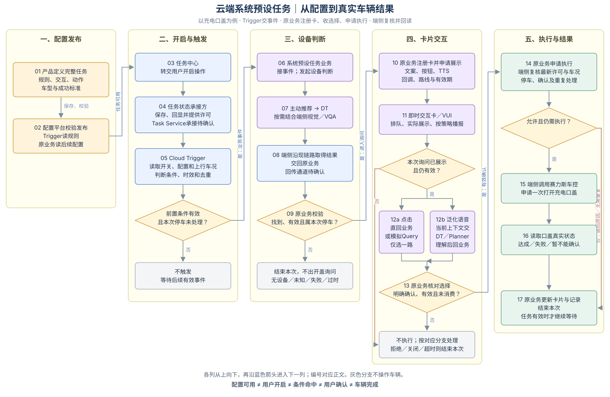

# 3.2 云端整体链路｜配置、触发、交互与执行

本节以“识别充电设备后打开充电口盖”为例，把云端公共框架与充电任务串成一条链路：**配置平台定义规则，任务中心提供启停入口，Cloud Trigger 判断条件并发出事件，系统预设任务业务组织识别和卡片交互，端侧复核后执行，原业务根据真实结果完成反馈。**

“系统预设任务业务”指这项任务的具体处理逻辑，不是另一个产品团队。即使由同一研发团队实现，也要区分通用 Trigger 的条件判断与具体任务的后续处理。

## 3.2.1 合并业务流程图

图从左向右按五个阶段阅读，各列内部从上向下。编号与下文一致。图中的设备判断和询问是本充电案例的处理方式，不要求所有云端任务都调用 DT 或逐次出卡。

## 3.2.2 按图逐步说明

### 一、配置平台：先定义任务怎样运行（01—02）

**01．产品定义完整任务。** 在配置平台填写关联任务、适用车型和版本、触发规则、后续判断、交互内容、车辆动作和结束策略。本例配置为：进入 P 挡时检查任务与 AI 主动服务开关、电量及口盖状态；满足后检查充电设备，明确发现后询问用户，确认后才申请开盖。SOC 不高于 20%沿用当前 PRD，不在合图中另改参数。

**02．配置平台保存、校验并发布。** 触发规则交给 Cloud Trigger 使用，设备判断、卡片和结果处理配置交给系统预设任务业务使用。发布前核对所选能力与车型版本是否匹配、后续业务是否承接。配置发布只是让任务具备运行条件，不等于用户已开启，也不等于当前要执行开盖。配置消费及生效回执的实际方式需平台与运行方确认。

### 二、任务中心与 Trigger：确定什么时候启动一次处理（03—05）

**03．用户在任务中心开启任务。** 任务中心展示任务说明并转交开启操作。本例用户开启“识别充电设备后打开充电口盖”，允许系统在适用场景主动检查和询问；这不代替本次开盖确认。

**04．任务状态承接方保存真实状态，并提供给运行方。** 保存结果回显任务中心；Cloud Trigger 读取本任务真实许可，原业务和端侧执行在需要时复核。这里不能仅凭任务中心按钮亮起就认为许可有效。你给的两张图对保存方表述不同，因此合图暂写“任务状态承接方”；是否由现有 Task Service 或其他模块承接、车辆还是账号范围，保留待确认，不把职责直接定给通用 Trigger。

**05．Cloud Trigger 接收状态变化，判断前置条件。** 本例由进入 P 挡启动检查，同时检查任务已开启、AI 主动服务已开启、SOC 不高于 20%、口盖关闭、所需状态有效，且本次停车尚未重复处理。满足后发出一次业务事件，包含哪项任务、哪辆车、哪次停车、触发原因及当时状态依据。未满足、数据不可用或已处理时，不进入设备识别，继续等待适用的后续事件。Trigger 的完成点是交出条件命中事件，不是拉卡或开盖。

### 三、系统预设任务业务与 DT：判断这次是否值得询问（06—09）

**06．系统预设任务业务接收事件，发起进一步判断。** 原业务接手本次流程，按配置调用主动推荐，并传递本次停车信息和检查设备的 Query。示例：“查看约定车外观察范围内是否有充电设备，返回观察结果。”检查请求本身不授权开盖，也不要求模型直接拉卡。

**07．主动推荐调用 DT，按需结合端侧视觉／VQA 判断。** VQA 是基于视觉内容回答问题的能力。这里要回答的是“约定范围内是否发现充电设备”，不是保证设备空闲、正常或适配本车。实际画面来源、观察范围和能力接入方式按现有链路会签，不根据合图臆定摄像头。

**08．端侧沿现有链路上行取得 DT 结果，结果交回原业务。** 保留你第二张图的这一步，不直接简化为“云端识别完就开盖”。需要交接的结果包括找到、未找到、无法判断或失败，以及本次关联和观察时间。端侧拿到结果后怎样回到系统预设任务业务，具体通道仍需接入双方确认；图中的箭头表示需要完成的业务交接，不冒充现有接口。

**09．原业务检查结果能否用于本次停车。** 只有明确找到设备、属于这次停车、没有过期且任务仍有效，才进入本例的开盖询问。未找到、无法判断、失败、超时或场景已失效，结束本次，不开盖，也不当成用户拒绝。本步骤由原业务承接，不重复放进通用 Trigger 的条件规则中。

### 四、即时交互卡与语音：获得这一次开盖的明确选择（10—13）

**10．原业务注册卡片并申请展示。** 原业务提供标题、正文、按钮、TTS播报内容、点击处理路线、语音路线、回调与有效期，并关联本次询问。例如：“检测到充电设备，是否打开充电口盖？”按钮为“确认打开／暂不打开”。最终文案应与视觉能力能证明的范围一致。**DT不注册、不直接拉起卡片。**

**11．即时交互卡／VUI 排队并实际展示。** VUI是车机上的语音与界面交互承接模块。它显示文本和按钮，按当前语音策略播报TTS，并向原业务回传实际展示或失败结果。请求受理不等于用户已经看到；只有当前询问实际展示且仍有效，才进入回答等待。排队不延长原识别结果有效期。展示失败、过时或任务关闭时，业务结束本次并按约定撤回卡片。

**12．点击和语音分别承接，但最终回到同一次询问。** 点击优先按本任务已选路线处理：若直回已接通，返回按钮选择给原业务；若使用静态 Advisor 兼容链路，则模拟带本次询问关联的 Query 交给回答理解能力，再把选择返回原业务。每张卡只选一种点击路线，不能两路同时执行。泛化语音则在卡片实际展示且上下文有效后，把用户表达与当前询问交给 DT／Planner 理解。这里沿用你材料中的称谓，二者是否别名或具体接入关系须统一，不画成两个必经的串行模型。

**13．原业务核对选择是否有效。** 仅明确同意当前这次开盖、询问未失效且尚未消费时，才进入执行；点击和语音同时确认也只消费一次。拒绝、关闭、超时不执行。用户问“为什么”或提出新诉求，不等于确认；旧询问保留还是结束按交互策略会签，期间不得自动开盖。卡片结束或被替换后，注销其回答上下文，迟到的“好的”不能恢复旧流程。

### 五、端侧执行与结果：确认车辆真正完成（14—17）

**14．原业务申请执行，端侧重新检查。** 请求关联本次任务、停车和有效确认。端侧在真正调用车控前检查任务仍有效、仍属于本次停车、处于 P 挡、口盖尚未打开、识别结果及确认仍适用，且没有重复执行。复核不通过就返回原因；若口盖已由用户打开，本次无需再次操作，不计作本任务执行了开盖。

**15．端侧调用赛力斯车控。** 只有复核允许，才申请一次打开充电口盖。车控是“要求车辆做动作”；端状态是“读取车辆现在怎样”，两者不能混为一项结果。请求返回成功只能按接口实际含义解释，不能自动当成口盖已经打开。

**16．读取口盖真实状态。** 在约定确认窗口内核对目标状态，区分目标达成、明确失败和暂不能确认。未立即打开不应立刻判失败，读不到也不能盲目重发。回读证明当前状态；若要计为本任务成功，还应结合本次请求及结果关联，避免把用户手动操作计作系统执行成功。

**17．原业务更新卡片和记录，结束本次。** 业务把实际结果反馈到仍有效的卡片，记录本次处理。卡片更新失败仅补传结果，不再次开盖。是否另同步 DT／Planner 对话上下文，按所选链路确认，不强制所有执行结果都再次经过模型。长期任务仍开启时继续等待下一次符合规则的场景；已关闭则不恢复。结束本次不自动关闭口盖。

## 3.2.3 一条连续案例

用户先开启这项任务。车辆随后进入 P 挡，SOC 为 19%，口盖关闭，任务与 AI 总开关均开启，本次停车未处理。Trigger 发出业务事件；原业务调用主动推荐及 DT／视觉判断；端侧按现有链路取得结果并交回原业务。结果显示在约定范围发现设备，仍属于当前停车，原业务申请展示询问卡。

卡片真正显示后，用户点击“确认打开”，或通过所选云端语音路线明确同意。原业务只消费一次有效确认，端侧复核当前条件后请求开盖。读取真实口盖状态，按本次请求关联判定结果，业务更新卡片并记录，长期任务继续等待下一次。

如果用户在等待中离开 P 挡、关闭任务、拒绝或超时，则在对应检查处结束本次，不继续开盖。已经下发的车辆请求不能仅因关卡就宣称撤销，仍须回收真实结果。

## 3.2.4 合图中保留的待确认项

| 事项 | 需要确定什么 | 对接角色 |
|---|---|---|
| 状态承接 | Task Service或实际承接模块；状态范围、同步及复核来源 | 任务中心、状态服务、Trigger及端侧执行 |
| DT结果回到业务 | 端侧取得结果后，由谁、经什么通道回传；观察范围与时效 | 原业务、主动推荐、DT与端侧视觉 |
| 当前卡片回答路线 | DT／Planner名称关系；点击直回或模拟Query择一；上下文注册与注销 | 原业务、即时卡、语音理解与主动推荐 |
| 数值与结束策略 | 识别、排队、回答及回读时间；拒绝后再触发；解释后的旧卡处理 | 系统预设任务产品与相关能力方 |

## 可编辑 Mermaid 源码

以下与上图使用同一组节点及业务分支；Mermaid自动排版与阅读版的固定分栏位置可能不同。

```mermaid
flowchart LR
  subgraph P[一、配置发布]
    direction TB
    P1["01 产品定义任务<br/>规则、交互、动作与适用范围"]
    P2["02 配置平台校验发布<br/>Trigger读规则；业务读后续处理"]
    P1 --> P2
  end
  subgraph T[二、开启与触发]
    direction TB
    T1["03 任务中心<br/>转交用户开启操作"]
    T2["04 任务状态承接方<br/>保存许可、回显并提供运行状态<br/>Task Service承接待确认"]
    T3["05 Cloud Trigger<br/>读取开关、配置与上行车况"]
    Q1{"前置条件有效<br/>且本次停车未处理？"}
    X1["不触发；等待后续有效事件"]
    T1 --> T2 --> T3 --> Q1
    Q1 -->|否| X1
  end
  subgraph B[三、设备判断]
    direction TB
    B1["06 系统预设任务业务<br/>接业务事件；发起设备判断"]
    B2["07 主动推荐 → DT<br/>按需结合端侧视觉／VQA"]
    B3["08 端侧沿现链路取得DT结果<br/>交回原业务；回传通道待确认"]
    Q2{"09 原业务校验<br/>找到设备、未过期、属本次停车？"}
    X2["结束本次，不出开盖询问<br/>无设备／未知／失败／过时"]
    B1 --> B2 --> B3 --> Q2
    Q2 -->|否| X2
  end
  subgraph I[四、卡片交互]
    direction TB
    I1["10 原业务注册卡片并申请展示<br/>文案、按钮、TTS、回调和有效期"]
    I2["11 即时交互卡／VUI<br/>排队、真正展示、按策略播报"]
    Q3{"本次询问已展示且仍有效？"}
    C["12a 点击<br/>直回业务或模拟Query择一"]
    V["12b 泛化语音<br/>当前上下文交DT／Planner理解"]
    Q4{"13 原业务核对选择<br/>本次明确确认、有效且未消费？"}
    X3["不执行；按对应分支处理<br/>拒绝／关闭／超时则结束本次"]
    I1 --> I2 --> Q3
    Q3 -->|是：点击| C --> Q4
    Q3 -->|是：语音| V --> Q4
    Q3 -->|否| X3
    Q4 -->|否| X3
  end
  subgraph E[五、执行与结果]
    direction TB
    E1["14 原业务申请执行<br/>端侧复核最新许可、停车、车况与有效确认"]
    Q5{"允许且仍需执行？"}
    E2["15 端侧调用赛力斯车控<br/>申请一次打开充电口盖"]
    E3["16 真实状态回读<br/>达成／失败／暂不能确认"]
    E4["17 原业务更新卡片与记录<br/>结束本次；任务有效才继续等待"]
    E1 --> Q5
    Q5 -->|是| E2 --> E3 --> E4
    Q5 -->|否：返回原因／无需重复| E4
  end
  P2 -->|配置生效、任务可用| T1
  P2 -.规则供Trigger、后续配置供业务.-> T3
  Q1 -->|是：交出一次业务事件| B1
  Q2 -->|是：本例进入询问| I1
  Q4 -->|是：仅一次有效确认| E1
  classDef cfg fill:#fff3dc,stroke:#cc9c38,color:#24344a;
  classDef state fill:#eaf2ff,stroke:#6087c7,color:#24344a;
  classDef biz fill:#f1eaff,stroke:#9c7ac4,color:#24344a;
  classDef vehicle fill:#e8f5ee,stroke:#63a286,color:#24344a;
  classDef decision fill:#fff5da,stroke:#cf9c47,color:#24344a;
  classDef stop fill:#f4f5f7,stroke:#a3acb8,color:#536174;
  class P1,P2 cfg;
  class T1,T2,T3,B3 state;
  class B1,B2,I1,I2,C,V biz;
  class E1,E2,E3,E4 vehicle;
  class Q1,Q2,Q3,Q4,Q5 decision;
  class X1,X2,X3 stop;
```

